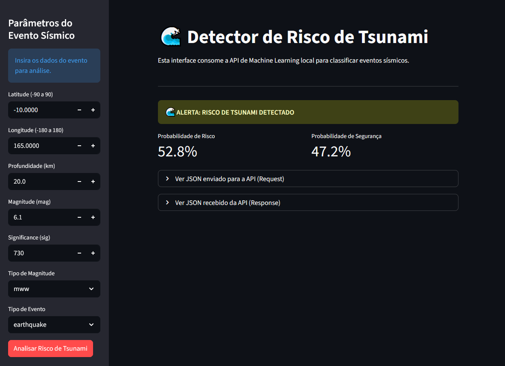

🌊 Tsunami Risk Detector 🌊

This project implements a complete data science pipeline to predict the risk of a tsunami being generated by a seismic event.

The system collects data from the USGS, processes and trains a machine learning model, and serves it via a Flask API, which is consumed by a web interface built in Streamlit.

📸 Application Demo



🛠️ Tech Stack

    Data Collection & Processing: Python, Pandas, Numpy

    ML Model: Scikit-learn, XGBoost, Joblib

    API (Backend): Flask, global-land-mask

    Interface (Frontend): Streamlit

    Requests: Requests

🏁 How to Run the Project

The project is divided into two main components: the Flask API (which serves the model) and the Streamlit Interface (which consumes the API). You will need two terminals.

1. Prerequisites

    Python 3.8+

    A requirements.txt file (you can generate one with pip freeze > requirements.txt)


# Clone the repository
git clone https://github.com/LHLobato/tsunami-risk-detection
cd tsunami-risk-detection

# Install the dependencies
pip install -r requirements.txt

2. Terminal 1: Run the Flask API

The API is the brain of the system. It loads the trained model (best_model.joblib) and the scaler.joblib.


# Navigate to the API folder
```sh
cd /path/to/project/api
python app.py
```
The terminal should display: Initializing Tsunami Detection API... Success, models loaded! and Running on http://0.0.0.0:5000/.

3. Terminal 2: Run the Streamlit Interface

This is the frontend that the user sees and interacts with.


# Navigate to the frontend folder
```sh
cd /path/to/project/frontend
streamlit run streamlit_app.py
```
Streamlit will automatically open in your browser at http://localhost:8501.

# Project Methodology

## 1. Data Collection

Data was collected from the official USGS Earthquake API (https://earthquake.usgs.gov/fdsnws/event/1/). A dataset of all seismic events recorded over a one-year period was used.

## 2. Processing and Feature Engineering

This was the most critical step. The raw dataset is not suitable for machine learning.

    Filtering: Selection of the most relevant features (mag, sig, type, geometry, tsunami).

    Extraction: Coordinates (longitude, latitude) and profundidade (depth) were extracted from the nested geometry.coordinates column.

    One-Hot Encoding: The categorical columns (properties.magType and properties.type) were transformed into numerical (binary) columns.

    Location Feature (Critical): A feature (is_land) was created using the global-land-mask library to determine if the epicenter was on land or in the ocean. This was crucial for removing false positives.

    Sample Selection: A final subset of 2155 samples was used for training.

## 3. Model Training and Selection

Three classification models were trained and evaluated:

    Logistic Regression

    Random Forest

    XGradient Boost (XGBoost)

The evaluation metrics were Accuracy, F1-Score, and ROC-AUC. XGBoost showed the best overall performance and was chosen as the final model (best_model.joblib).

## 4. Hybrid API (Model + Rules)

A simple Flask API (app.py) was developed to serve the XGBoost model. However, testing revealed that the model (even after retraining) had a strong bias, classifying earthquakes on land or at extreme depths as tsunami risks.

To solve this, the API was implemented with a hybrid approach:

    Filter Rules: The API first checks 4 "golden rules" that immediately nullify the risk:


        type_earthquake == 0 (Event was not an earthquake)

        mag < 7.0 (Magnitude is below the risk threshold)

    Model Inference: Only if an event passes all these rules (e.g., Mag 7.5, in the ocean, 20km deep) is it sent to the XGBoost model for the final classification.

This ensures the system is robust against obvious false positives while leveraging the power of machine learning for the "difficult" gray-area cases.
